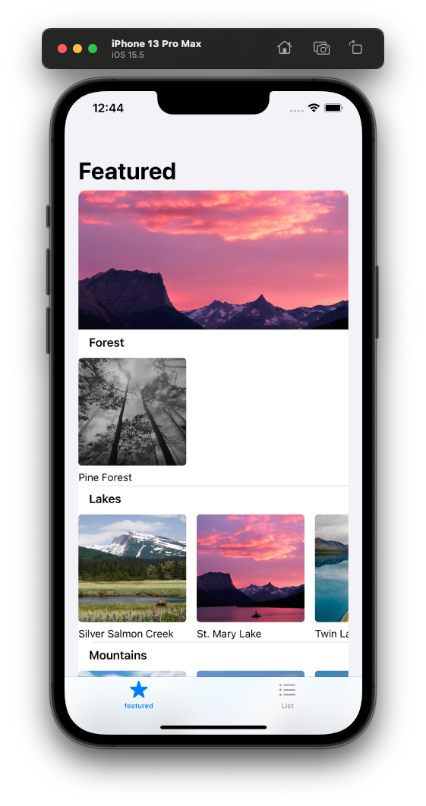
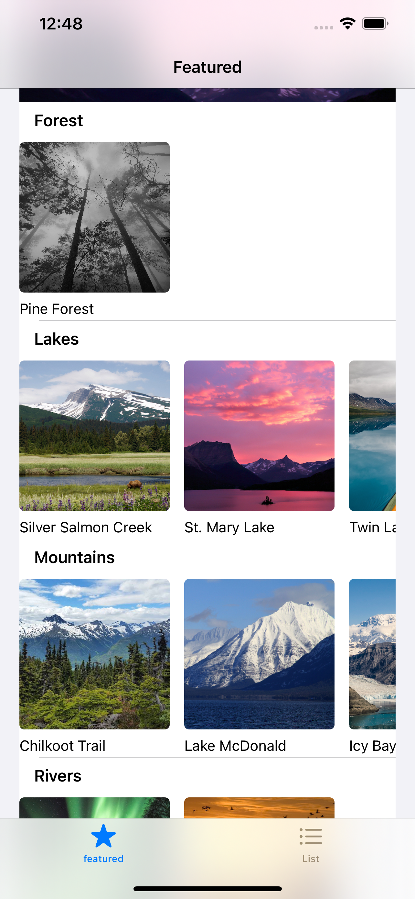
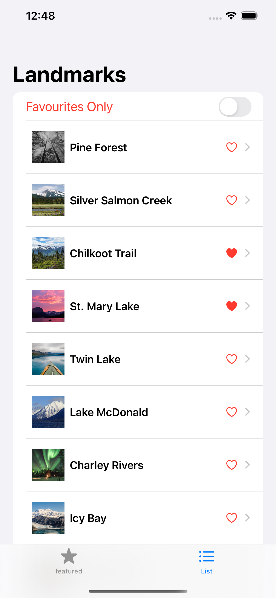
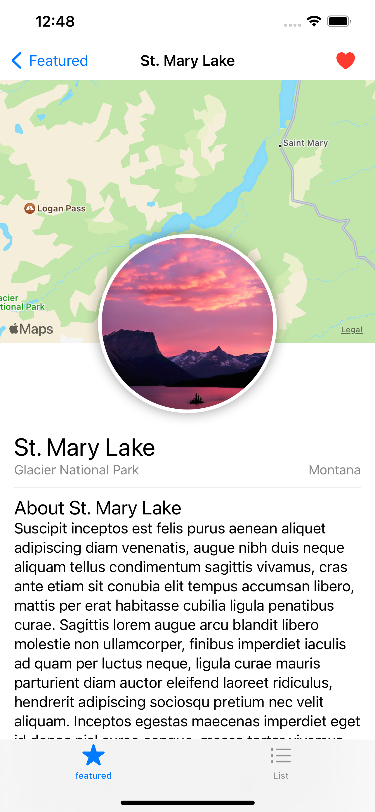

# Landmarks App

IOS app made using Swift UI following the tutorial on [developer.apple.com](https://developer.apple.com/tutorials/swiftui/creating-and-combining-views).

It's a good starter point to get into iOS App Development using SwiftUI and XCode. A lot of new stuff is introduced and even interfacing with some frameworks like MapKit and UIKit is explained. Overall a good begineer project to get your hands dirty and get started with Swift and Swift UI

 ## Screenshots
 
 ### Screenshot with iPhone
 
 s
 ### Featured Page

### Landmarks List Page

### Landmark Detail Page

